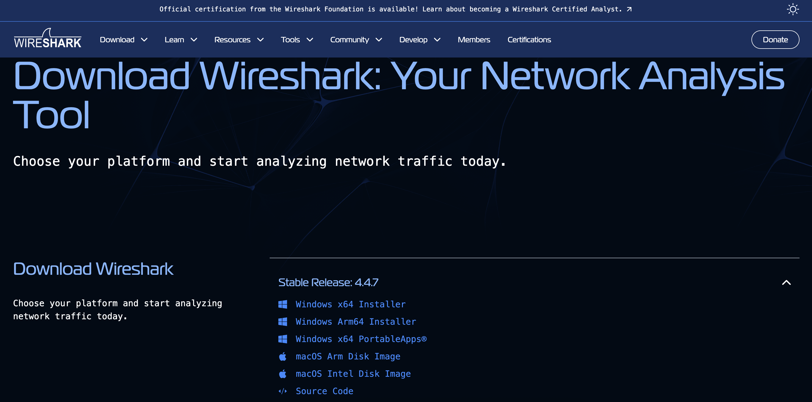
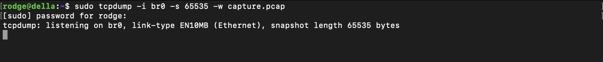
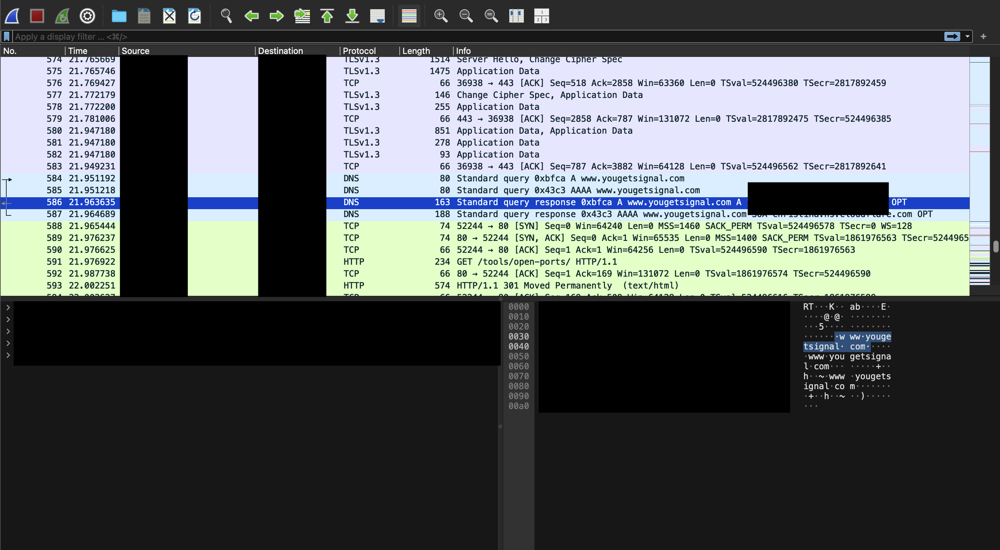

## Abstract

This project will simulate a Linux environment created with virtualization using QEMU/KVM/libvirt  to emulate a standard user environment on a singular Ubuntu server. For each virtualized endpoint, basic web traffic will be generated to simulate user behavior through a containerized python script using Docker and Git for version control. Traffic can be verified to be flowing correctly and analyzed with WireShark and tcpdump. Other tools will be used to expedite and optimize the process such as tmux for parallel virtual machine use and Tailscale to allow a remote VPN.

 

## Introduction

The project aims to deepen my understanding with networking fundamentals, practice DevOps and System Administrator concepts, and familiarize myself with relevant network engineer industry technologies and tools.

This environment is a continuation from a previous home server project dedicated to getting a functioning Ubuntu server setup that is able to connect with other devices on the network and the internet.

The scope of this lab is to achieve a functional headless virtual network environment (no GUI) with at least 2 virtual machine endpoints using a linux distro all running under the one Ubuntu server, where each end VM will simulate web traffic through a python script, this script will be able to be deployed rapidly with images and containers while the traffic flow from this virtual network will be monitored using Wireshark. 

The project is mainly focused on fundamental basics and functionalities for networking, virtualization, and containerization and does not cover other practices and  advanced topics such as security, orchestration/automation, and other types of network traffic but however can be expanded on in the future.       

## Tools/Software

- Linux - OS environment that will be worked in
- KVM/QEMU - modules and software used to allow virtualization capabilities
- Tailscale - allow remote VPN access to network
- Docker/Git - containerize the python script and allow version control
- Python (requests, time, random)- programming language used to design web traffic script along with the packages needed to create the script
- Wireshark (tcpdump) - network monitoring tool to analyze the traffic flow from virtual network
- Ubuntu/Debian - Linux distros used for main server and virtual endpoints

## Step-by-Step Guide

## 1. Virtualization

In order to create a network, it will need devices to be the sources and destinations for network traffic. In the case for a simulated network, this can be accomplished through the use of virtualization which is a powerful tool in rapid deployments at an inexpensive cost.

*It is important to note the system is operating in an Ubuntu 24.04.2 LTS Server environment*

### 1.1 Check if Virtualization is supported

```bash
egrep -c '(vmx|svm)' /proc/cpuinfo
```

- This command will check if your processor supports virtualization
- Returns the amount of threads that support virtualization
- IF 0, check with BIOS settings and hardware support pages to see if setting can be enabled

### 1.2 Install necessary packages

```bash
sudo apt update
sudo apt upgrade
sudo apt install qemu-kvm libvirt-daemon-system libvirt-clients bridge-utils virt-manager
```

- Run these commands to install the latest packages needed to replicate virtualization used in this project
- qemu-kvm —> qemu is a hardware emulator, kvm assists qemu for faster performance
- libvirt-daemon-system —> VM manager framework
- libvirt-clients —> tools and commands to allow interaction with VMs
- bridge-utils  —> allows virtual bridges to connect VMs to a network

### 1.3 Start libvirt

```bash
sudo systemctl enable --now libvirtd
```

- Enable libvirtd service to ensure that it will start on boot so VMs are ready always

### 1.4 Configure netplan yaml file / Deploy virtual bridge

- Navigate to /etc/netplan
- Directory should contain a yaml file for system network configurations

```bash
network:
  version: 2
  renderer: networkd
  ethernets:
    enp3s0:
      dhcp4: no
      dhcp6: no
  bridges:
    br0:
      interfaces: [enp3s0]
      dhcp4: yes
```

- This is a functional configuration to allow virtual bridging between VMs, native system, and the internet

### 1.5 Create VMs

```bash
sudo virt-install \
	--name debian-ep4 \
	--location http://ftp.us.debian.org/debian/dists/bullseye/main/installer-amd64 \
	--ram 2048 \
	--vcpus=2 \
	--disk path=/var/lib/libvirt/images/debian-vm.qcow2.4,size=20 \
	--os-variant debiantesting \
	--network bridge=br0 \
	--graphics none \
	--console pty,target_type=serial \
	--extra-args "console=ttyS0,115200n8 serial"
	--boot uefi \
	
 
```

- Use the following command to deploy a Debian VM

### 1.5.1 VM Setup


- Go through general setup (language, time, hostname and passwords)
- When going through setup always select the RECOMMENDED option (ex. select [deb.debian.org](http://deb.debian.org) mirror)


- If prompted, can continue no need to setup this


- Use entire disk


- Select finishing partitioning and confirm all processes with partitioning


- No need to modify anything here, just continue


- Select “Yes”


### 1.6 VM Start


```bash
virsh start <vm-name>
```

- VM will be shut off from reboot, Start the VM Name with this command


```bash
virsh console <vm-name>
```

- After start console into the VM with this command


- Should be met with a login screen

## 2. Scripts/Containers

Now that virtual machines are successfully installed and function, these virtual machines need to perform tasks. This can be implemented through containerization which ensures consistent configurations for processes. In this section, we will pull an image of a basic python script I have designed to simulate web user traffic. 

### 2.1 Install Docker

```bash
su
```

- Escalate current user account to root with this command

```bash
# Add Docker's official GPG key:
sudo apt-get update
sudo apt-get install ca-certificates curl
sudo install -m 0755 -d /etc/apt/keyrings
sudo curl -fsSL https://download.docker.com/linux/debian/gpg -o /etc/apt/keyrings/docker.asc
sudo chmod a+r /etc/apt/keyrings/docker.asc

# Add the repository to Apt sources:
echo \
  "deb [arch=$(dpkg --print-architecture) signed-by=/etc/apt/keyrings/docker.asc] https://download.docker.com/linux/debian \
  $(. /etc/os-release && echo "$VERSION_CODENAME") stable" | \
  sudo tee /etc/apt/sources.list.d/docker.list > /dev/null
sudo apt-get update

sudo apt-get install docker-ce docker-ce-cli containerd.io docker-buildx-plugin docker-compose-plugin
```

- Install Docker engine with this entire command

### 2.2 Pull python script

```bash
docker pull rodgiee/traffic_sim
```

- Use this command to pull the latest docker image of my python script

```bash
docker container create rodgiee/traffic_sim
```

- Once the image is installed, the container can be created with this command

```bash
docker container ls --all
```

- Verify that the container was built and exists
- Take note of the container ID that was created

```bash
docker container start <container_id>
```

- Start the container with this command, obtain the container ID from prior command
- Upon start, the python script should be working

## 3. Wireshark

Wireshark is an integral tool for traffic analysis and monitoring. Now that the virtual network is setup, the devices can communicate, and the script is actively working. This can be verified by inspecting the network traffic to see if the script is working properly.

### 3.1 Install Wireshark



- Ensure that you select the right installer based on your OS, you can install Wireshark here: [https://www.wireshark.org/download.htm](https://www.wireshark.org/download.html)l

### 3.2 Capturing Traffic

- Ensure that the current session is the main machine and not a VM
- VM’s can be exit with CTRL + ]

```bash
sudo tcpdump -i br0 -s 65535 -w capture.pcap
```

- Capture traffic from br0 which is the virtual bridge created from section 1
- 65535 size NEEDS to be established for wireshark to be able to properly read the packet capture file



- tcpdump will begin to listen to traffic
- CTRL + Z to stop listening for traffic

### 3.3 Sending capture.pcap

- You can send the capture.pcap file through SSH

```bash
sudo scp remote_user@remote_hostname:remote_file_location host_file_location
```

- Use this command to transfer the file from a remote SSH session to your host machine

### 3.4 Open capture.pcap

- Opening the pcap file will depend on the OS but should be fairly the same
- On launch it should open with Wireshark along with all network traffic
- Here is a list of websites that should be getting queried

```bash
https://example.com
https://httpbin.org
https://neverssl.com
https://icanhazip.com
https://www.boredpanda.com
https://www.spacejam.com
https://www.pointerpointer.com
https://www.zombo.com
https://jsonplaceholder.typicode.com
https://reqres.in
https://fakerestapi.azurewebsites.net
https://tools.keycdn.com
https://www.yougetsignal.com/tools/open-ports
https://www.browserleaks.com
https://www.speedtest.net
https://developer.mozilla.org
https://www.w3schools.com
https://www.freecodecamp.org
https://www.npr.org
https://www.hackaday.com
https://www.theonion.com
```



- Inspection of Wireshark from the Info tab should show that the webiste website was queried
- In the above example [www.yougetsignal.com](http://www.yougetsignal.com) was queried from one of my virtual machines
- This means that the virtual machines are able to successfully connect to the internet and communicate

## Timeline

### Day 8-12 (Virtualization)

In order to make this entire project possible, I will need to create the environment that I will be operating in. There are many ways to go about creating a simulated network but I ultimately decided on using virtualization with a type 2 hypervisor qemu-kvm since I already had an Ubuntu server installed.

The next steps I took was installing qemu-kvm along with libvirt libraries to aid in setting up virtual machines, the difficulty with this project is that we are operating strictly on a headless CLI environment which was a straightforward process by installing the necessary libraries.

The difficult part of the entire virtualization section was creating the virtual machines and network configuration yaml file to allow network and internet connections to the virtual machines.

The network first issue with setting up the virtual network was trying to set up a virtual bridge using the bridge-utils package, I had the initial configuration to be that the physical interface of the server have their own IP address which would conflict with the virtual bridge since both interfaces would be trying to route traffic, what needs to be done is that the physical interface will no longer have any IP configuration assigned and the virtual bridge will handle all traffic routing to virtual machine and the native system itself. The next issue this creates is that the server no longer is able to get connection since the associated MAC address with the server is no longer the physical interface but the virtual bridge instead so I needed to re-create a DHCP reservation for the virtual bridge.

The most difficult problem I had with this entire project was creating the virtual machines where I ran into multiple issues on deploying the VMs. I initially tried to use another Ubuntu OS server image as my operating system for the VMs but when I had done this the virtual machine upon creation would not boot up with anything. Upon further research there seems to be history from forums where using a Ubuntu has issues with displaying on CLI for VM use, I tried common fixes such as installing different versions of Ubuntu, trying a non-live version of Ubuntu, installing the OS image directly from the FTP server rather than installing the image first and then mounting the image, and different configuration settings for the VM creation which took course of a couple days. I ended up with a specific configuration of using Debian instead and specify that I will be using the console serial ttyS0,115200n8 which allows the CLI to be use instead of the GUI.  

### Day 13 (Python Script/Wireshark)

Once the virtual machines were running. The next step was having these virtual machines send out web traffic on their own which can be done via scripting. I ultimately decided on using python since I did not need anything too complex and I selected using the requests, time, and random packages to initiate web traffic requests and also send out these requests to random websites and random times.

Did not run into much issues with the script besides requests being blocked due to sending out too much traffic which was resolved by just lowering the frequency of how often traffic was sent out.

I also wanted to make the website selection modifiable and not hard-coded so I had python read out a list of websites from a txt file that should be within its own directory so if I wanted to remove or add more websites, I can do so by just easily editing the websites.txt file.

Once the script has been executed I needed to confirm that traffic was actually being sent out from the machine that was running the script. I wanted to use Wireshark to get more experience with the software and to also just verify that traffic was flowing.

I wanted to capture traffic by listening on that machine and recording the contents into a file and being able to take that file to any machine that has wireshark for later analysis. I ran into multiple issues with Wireshark not being able to read the file that was captured from a general tcpdump capture and what I found to be the issue is that it needed to be in a pcap format and the size needs to be set to capture at 65535 byte sizes. Once I was able to resolve that I was able to confirm that traffic was being sent to the intended websites from the script.

### Day 14-17 (Containerization)

Docker was the final concept I wanted to explore while working on this project. Containerization is a key concept in the world of cloud, system administration, and CI/CD. It ensures consistent deployments of processes and that was something I can apply to the python script when delivering to my virtual machines.

I spent a couple of days learning the basics of Docker: What is an image? What is a container? How do these relate to one another? How do you create an image or container? What are the commands and packages necessary for Docker to work?

Building out the dockerfile was straightforward enough but deploying them on the virtual machines was the difficult part. The first problem I ran into was for some reason the virtual machines were having issues with pulling the image from my Dockerhub repo, so after doing some research making the repo private and using docker login fixed the issue but not sure why. Another issue was that I built the docker image from my Mac laptop so when I had pulled the image into my Debian VM, it would not build the image since it was incompatible with it. The workaround was that I pulled the docker directory from Git, built the image on the VM, and pushed the new image to docker hub. After all this was resolved, I was able to build and run python containers on my Debian VMs.  

### Day 18 (Implementation)

With all of this combined, I was able to create a functioning simulated network. The last thing I needed to do now is to confirm that traffic was flowing from the virtual machines to my home router. I can verify that traffic was coming from my virtual machines by listening from the virtual bridge using the tcpdump command along with specifying 65535 byte capture size in pcap format. After capturing and sending this file from my Ubuntu server to my Mac laptop, I was able to successfully establish that traffic was being sent from my virtual machines and to the internet!

Although this was the goal for my project, more can be expanded on from what was accomplished. I can add more to the python script to simulate various other types of traffic such as downloads, uploads, DNS queries, pings, emails, media streaming, and more. Applying security configurations such as firewalls, packet filtering, IPS, monitoring and more.
